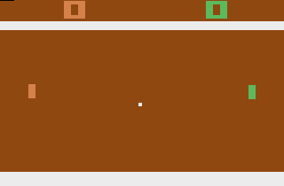

# monte-carlo-tree-game
Monte Carlo Tree Search for pong game

### Game Samples (MCTS is P1 - on the right)

##### Against "safe opponent" (tries to hit the center):



##### Against "aggressive opponent" (tries to hit the edges):


### Requirements
```bash
python=>3.7
gym==0.16.0
```

### Installation

```bash
pip install -r requirements.txt
pip install 'gym[atari]'
```

### Potential problems
- missing **ffmpeg**
- missing **libav-tools** (Ubuntu)

## Nim Game

### Usage
To start the game
```bash
python nim_runner.py
```

Setup a game (3 piles and 20 randomly set objects):
```bash
Set game settings (`number of piles` `number of objects`): 3 20
```

Making a move (remove 2 objects from second pile):
```bash
Your move: 1 2
```

## Pong game

Start random game
```bash
python run_gym_random.py
```

Start responsive game
```bash
python run_gym_keyboard.py
```

Read the instructions in the console.

### Implementation notes

`gym.make` returns environment (`env`) which allows us to make steps by passing action as a parameter to `env.step(action)`.

`env.step()` returns Tuple with 3 values:
- **object** - RAM dump 128 elements vector
- **reward** - -1.0, 0, 1.0 (loss, neutral, win)
- **done** - is game done

We can close and restore states by using one of those methods:

- **clone_state()** - close emulator state w/o system state (not cloning pseudorandomness)
- **restore_state(state)** - restores state from **close_state**
- **clone_full_state()** - close emulator with system state
- **restore_full_state(state)** - restores state from **clone_full_state**

#####Usage:
```python
state = env.clone_state()
```

## Atari RAM values positions for PONG

After a long time searching through the RAM dumps we've manage to figure out where values are stored:

- **RAM_PLAYER_1_POS = 60**
- **RAM_PLAYER_2_POS = 59**
- **RAM_BALL_Y_POS = 54**
- **RAM_BALL_X_POS = 49**  # 128 is center, 68 is when hits left agent, 188 when right agent, 52 when outside left, 204 when outside right
- **BOUNCE_COUNT = 17**
- **BALL_IN_THE_WALL = 20**  # != 0 means it's in the wall
- **P_RIGHT_SCORE = 14**
- **P_LEFT_SCORE = 13**
- **ROUND_NUM = 9**
- **BALL_DIRECTION = 18**  # 1 means LEFT 0 means RIGHT (only applied when ball got hit before that 255 which is also LEFT)
- **PREVIOUS_HIT_SOURCE = 12**  # 0 - no ball, 64 - nothing hit the ball yet (start of the game),
 128 - wall hit a ball, 192 - player hit a ball. Vales are weird because usually when hit it goes from 194 to 192 and from 71 to 64 (71, 70, 69, 68, 67, 66, 65, 54) so better check ranges but always starts above the value